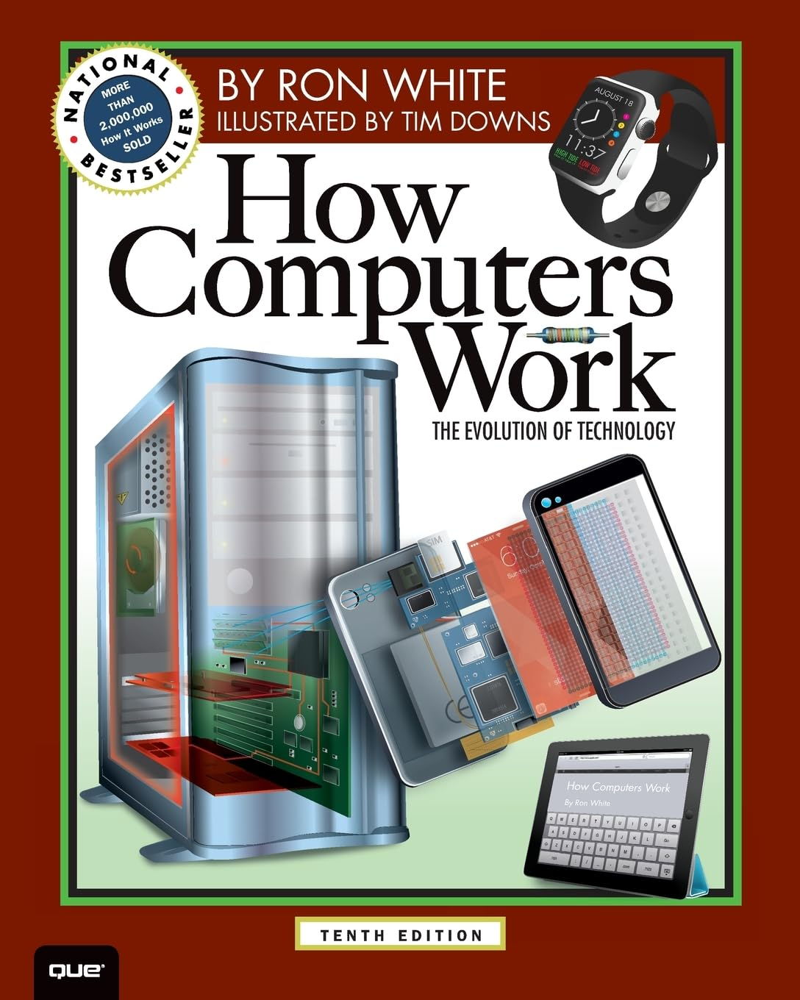

# Fundamentals of Computer and Programming Course

{ width="150"  align=right loading=lazy}

Our course, "Entrepreneurship for Computer Scientists and Engineers," at [Amirkabir University of Technology](http://ce.aut.ac.ir){ target="_blank" } provides a comprehensive foundation in entrepreneurial thinking, innovation strategies, and venture creation tailored specifically for students in technical disciplines. Through a blend of theoretical frameworks and hands-on projects, participants learn how to identify market opportunities, develop scalable solutions, and navigate the startup ecosystem. The curriculum emphasizes interdisciplinary collaboration, lean startup methodology, and the ethical and societal impact of technology-driven ventures—empowering future engineers and computer scientists to become visionary founders and changemakers.

---

## Course Objectives

This course aims to:

- Develop problem-solving skills and algorithmic thinking essential for programming.
- 

---

## Learning Outcomes

- By the end of the course, students will:

    * Develop real-world applications using C programming skills.

--- 

## Course Outline

{ width="150"  align=right loading=lazy}

### 1. Introduction to Computing

- Fundamentals of computing
- Historical perspective and early computers
- Overview of hardware, software, and the Internet

### 2. Introduction to C Programming
- Basics of C programming
- Input/output operations
- Data types and arithmetic operations

### 3. Decision-Making Statements
- `if`, `if-else`, and nested `if`
- `switch` statements for multi-way branching
- Logical operators and expressions

### 4. Repetition Statements
- `for` loops for counter-controlled repetition
- `while` loops for condition-controlled repetition
- `do-while` loops for post-condition checks
- Break and continue statements for loop control

### 5. Structured Program Development
- Algorithm development and problem-solving
- Functions and recursion
- Enumerations and random-number generation

---

## Team 

### Instructor

[**Morteza Zakeri**](https://dl.acm.org/profile/99660089625){ target="_blank" }†

† Ph.D. in Computer Science, ACM Member (`mzakeri-nasrabadi[at]acm.org`).

### Teaching Assistants

* TA Head (Fall 2025): Javad Besharati-far
* 

---

## Additional Information

- **Prerequisites**: No prior programming experience required. Familiarity with basic mathematics will be beneficial.
- **Assessment Methods**: Graded assignments, quizzes, practical programming tasks, paper-based exams, laboratory classes, and a final project.
- **Recommended Textbook**: *C How to Program, 9/e* by Paul Deitel and Harvey Deitel.

---

## References

### Main textbooks

{ width="150"  align=right loading=lazy}

1. Paul Deitel and Harvey Deitel, [**C How to Program, Ninth Edition, 2022**](https://deitel.com/c-how-to-program-9-e/){ target="_blank" }.

The book *C How to Program, Ninth Edition* by Paul Deitel and Harvey Deitel is a comprehensive guide to C programming. It offers a code-intensive, case-study-oriented approach suitable for both introductory and intermediate-level courses. The book covers a wide range of topics, including problem-solving, algorithm development, control statements, functions, arrays, pointers, and data structures. It also includes over 140 complete working programs, real-world examples, and self-check exercises to reinforce learning. 

 

{ width="150"  align=right loading=lazy}

2. R. White, [**How Computers Work: The Evolution of Technology**](https://www.oreilly.com/library/view/how-computers-work/9780133096798/){ target="_blank" }, 10th ed. Indianapolis, IN, USA: Que Publishing, 2014.

*How Computers Work: The Evolution of Technology* by Ron White is a visually engaging and comprehensive guide to understanding the inner workings of computers and modern technology. The book explores the evolution of computing devices, from early machines to today's smartphones, tablets, and wearable tech. It features detailed illustrations and jargon-free explanations, making complex concepts accessible to readers of all technical levels. Topics include hardware, software, miniaturization, quantum physics applications, and the impact of technology on daily life.

### Helpful textbooks

3. B. W. Kernighan and D. M. Ritchie, *The C Programming Language*, 2nd ed. Upper Saddle River, NJ, USA: Prentice Hall, 1988.

4. H. Schildt, *C: The Complete Reference*, 4th ed. New York, NY, USA: McGraw-Hill, 2000.

